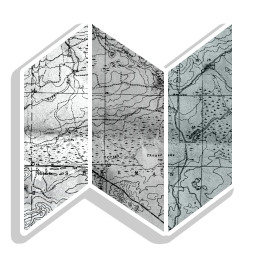
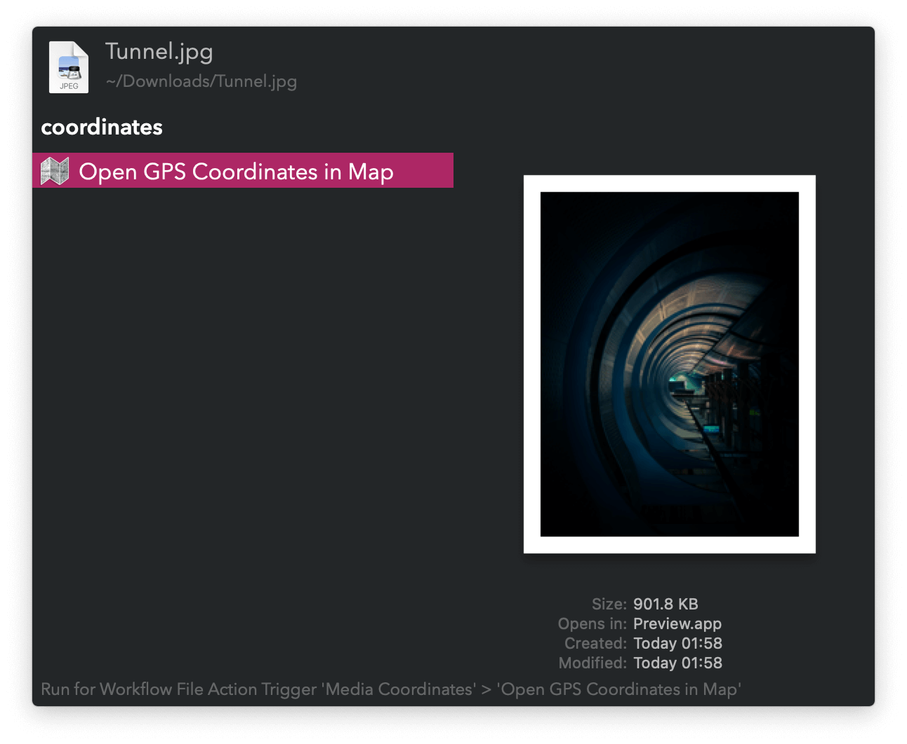

#  Media Coordinates Alfred Workflow

Open photo, video, and audio GPS coordinates in a map

[⤓ Install on the Alfred Gallery](https://alfred.app/workflows/vitor/media-coordinates)

## Usage

Use the [Universal Action](https://www.alfredapp.com/help/features/universal-actions/) on an image, video, or audio, to open its recorded GPS location in Apple Maps or Google Maps.

